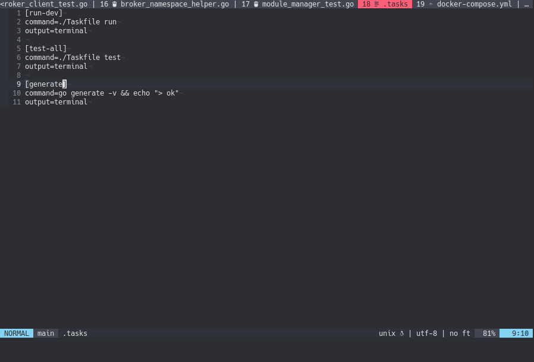

# telescope-asynctasks.nvim

Integration for [asynctasks](https://github.com/skywind3000/asynctasks.vim) with
[telescope.nvim](https://github.com/nvim-telescope/telescope.nvim)

# Demo



# Installation

```viml
" install asynctasks
Plug 'skywind3000/asynctasks.vim'
Plug 'skywind3000/asyncrun.vim'

" install telescope
Plug 'nvim-lua/popup.nvim'
Plug 'nvim-lua/plenary.nvim'
Plug 'nvim-telescope/telescope.nvim'

" install this integration
Plug 'GustavoKatel/telescope-asynctasks.nvim'
```

# Usage

```lua
-- Fuzzy find over current tasks
require('telescope').extensions.asynctasks.all()
```
